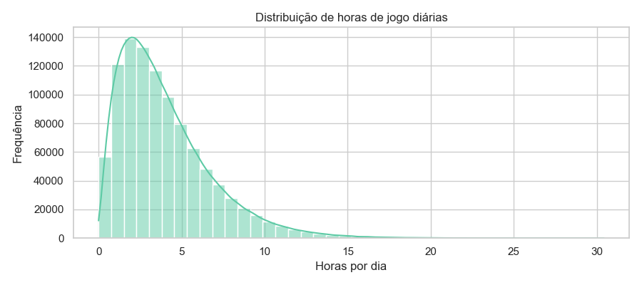
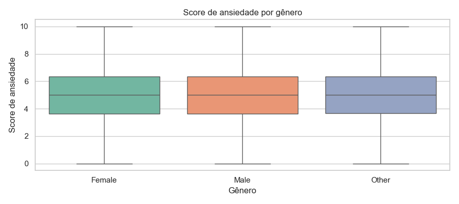
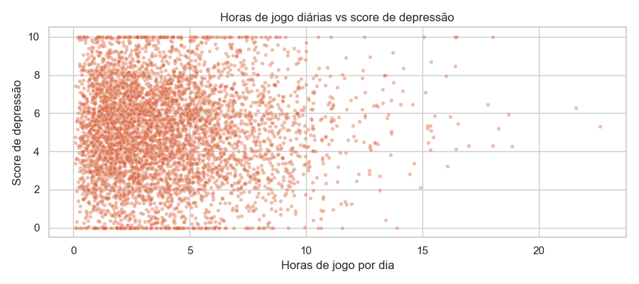
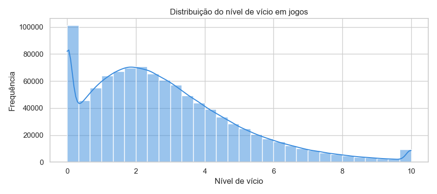
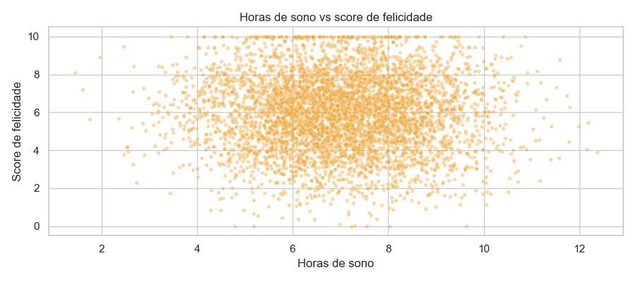

# Relatório de Gráficos — Camada Silver

Dataset: `data/silver/dataset_clean.parquet`  
Total de linhas: 1,000,000  
Gráficos de dispersão usam amostra de 5.000 linhas.

## Gráfico 1 — Distribuição de horas de jogo diárias

## Gráfico 2 — Score de ansiedade por gênero

## Gráfico 3 — Horas de jogo diárias vs score de depressão

## Gráfico 4 — Distribuição do nível de vício em jogos

## Gráfico 5 — Horas de sono vs score de felicidade

